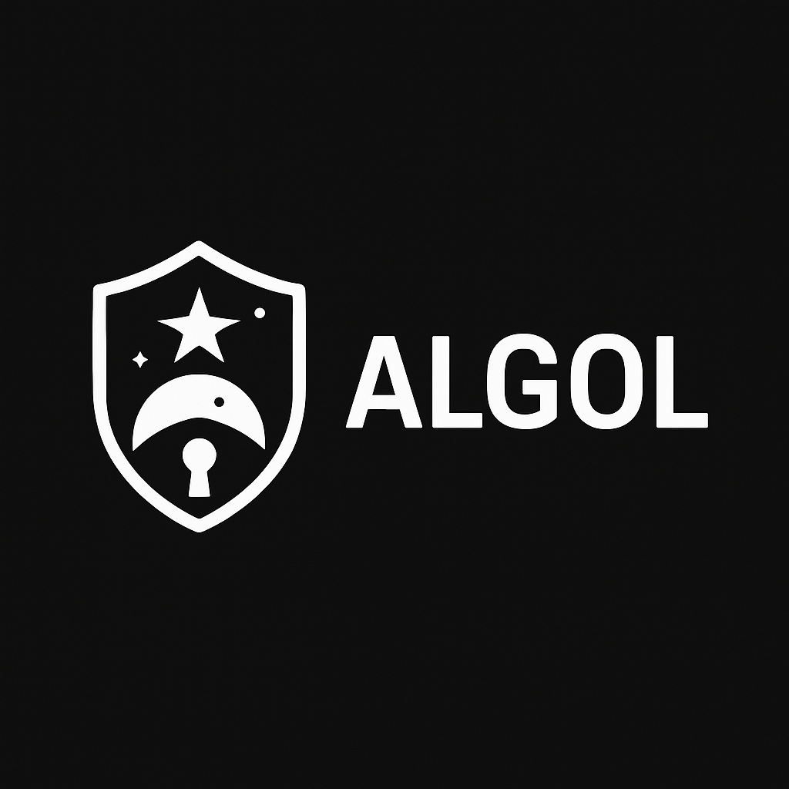

# Algol - JWT & Encryption Utility Library

**Algol** is a security-focused Java utility library that provides essential components for JWT (JSON Web Token) generation, verification, and AES-based encryption/decryption. It is designed to work as a foundational module for secure applications, including but not limited to authentication servers and resource-protecting services.

---

## 📦 Features

- 🔐 **JWT Signing and Verification (RS256)**
- 🔑 **PEM Key Loading Utility (Public/Private/AES Keys)**
- 🔁 **AES-based Encryption & Decryption**
- 🔎 **JWT Claim Extraction Utilities**
- 🧱 **Builder Pattern for Configurability**
- 💥 **Custom Exception Hierarchy**

---

## 📁 Package Structure

```
io.github.mockup.algol
├── encrypter
│   ├── AlgolEncrypter
│   └── AlgolEncrypterBuilder
├── jwt
│   ├── AlgolJwtIssuer / Builder
│   ├── AlgolJwtVerifier / Builder
│   ├── AlgolJwtClaimExtractor
├── util
│   └── AlgolKeyLoaderUtil
├── exception
│   ├── AlgolEncrypterException
│   ├── AlgolJwtException
│   └── base
│       ├── AlgolException
│       └── AlgolRuntimeException
```

---

## 🔧 Usage Overview

### JWT Issuer (Signing)
```java
AlgolJwtIssuer issuer = AlgolJwtIssuerBuilder.builder()
    .key("/path/to/private.pem")
    .expiration(Duration.ofMinutes(15))
    .build();

String jwt = issuer.issue("user123", "USER ADMIN");
```

### JWT Verifier
```java
AlgolJwtVerifier verifier = AlgolJwtVerifierBuilder.builder()
    .key("/path/to/public.pem")
    .build();

Claims claims = verifier.verify(token);
String subject = AlgolJwtClaimExtractor.getSubject(claims);
List<String> roles = AlgolJwtClaimExtractor.getRolesFromCsv(claims);
```

### AES Encryption
```java
AlgolEncrypter encrypter = AlgolEncrypterBuilder.builder()
    .key("/path/to/secret.key")
    .iv("/path/to/secret.iv")
    .build();

byte[] encrypted = encrypter.encrypt("Hello".getBytes());
byte[] decrypted = encrypter.decrypt(encrypted);
```

---

## 📁 Default Key File Paths
- Private Key: `~/.algol/secret/private.pem`
- Public Key : `~/.algol/secret/public.pem`
- AES Key    : `~/.algol/secret/secret.key`
- AES IV     : `~/.algol/secret/secret.iv`

These paths are used by the `defaultXxx()` factory methods for quick setup.

---

## 🚨 Exception Handling
All core features use unified exception classes:

- `AlgolJwtException`
- `AlgolEncrypterException`

These wrap lower-level exceptions like `IOException`, `GeneralSecurityException`, and `JwtException` to keep your business logic clean.

---

## 📌 Notes / Best Practices

- Always protect the `~/.algol/secret/` directory with appropriate file permissions.
- Use `RS256` over `HS256` for better key management and decoupling between issuer/verifier.
- Keep `AlgolJwtIssuer` and `Verifier` as Spring-managed beans to avoid repeated key loading.
- If needed, extend `AlgolJwtClaimExtractor` to support custom claims.

---

## 🧩 Ideal Usage Scenarios
- Authentication/Authorization Server (e.g., Polaris)
- Resource Servers (e.g., Zenith)
- Token-based microservices

---

## 📅 Roadmap / Considerations

- [ ] JWK (JSON Web Key) loading and key rotation support
- [ ] Keypair auto-generation on first run
- [ ] Support for Refresh Tokens and revocation tracking
- [ ] Custom claim types with validation hooks
